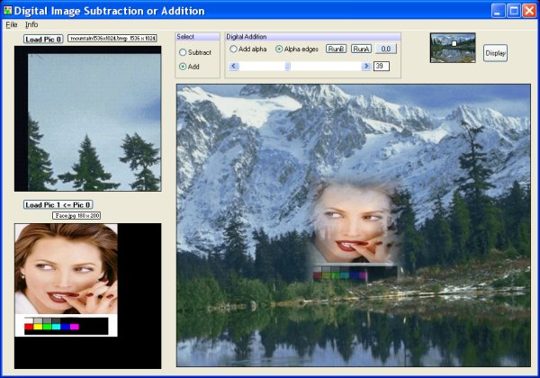



## Digital Image Subtraction or Addition \(16th Mar\. Correction to Save result\)

### Description

Digital Image Subtraction or Addition by Robert Rayment. (16th Mar. Correction to Save result) Combines two images by subtraction (Minus or Xor) or addition ( Whole Image or Edge Transparency). Subtraction only shows the difference bewteen two images and addition combines the images. The first image forms the base and the second, size equal or smaller than the base, takes the effects. Hand-scrolling is used rather than scrollbars, where the display is from a windowed array. Results can be saved as a bmp. Can run with Basic or MMX machine code. The machine code is held in a res file and the asm file included for reference. Couple of images included. CodeId=58968 has some subtraction images. dreamVB frames are used (CodeId=58966). Please see menu item Info. In particular the screen res needs to be >= 1024x768.

Zip 189 KB.
 
### More Info
 
Images

Just run

             |
---                |---
**Submitted On**   |2005-03-04 11:44:52
**By**             |[Robert Rayment](https://github.com/Planet-Source-Code/PSCIndex/blob/master/ByAuthor/robert-rayment.md)
**Level**          |Intermediate
**User Rating**    |4.7 (71 globes from 15 users)
**Compatibility**  |VB 6\.0
**Category**       |[Complete Applications](https://github.com/Planet-Source-Code/PSCIndex/blob/master/ByCategory/complete-applications__1-27.md)
**World**          |[Visual Basic](https://github.com/Planet-Source-Code/PSCIndex/blob/master/ByWorld/visual-basic.md)
**Archive File**   |[Digital\_Im1865193162005\.zip](https://github.com/Planet-Source-Code/robert-rayment-digital-image-subtraction-or-addition-16th-mar-correction-to-save-result__1-59299/archive/master.zip)

### API Declarations

See code

